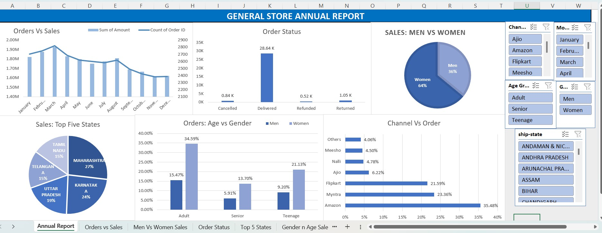

# General Store Annual Sales Dashboard

This project presents a comprehensive Excel-based dashboard built for analyzing annual sales data from a general store. The dashboard provides actionable insights into customer behavior, sales trends, and product performance, enabling data-driven decisions for future business strategies.

## Project Summary

- **Data Source**: Sales data covering over **12,000+ transactions**
- **Time Period**: 12 months (January–December 2022)
- **Tools Used**: Microsoft Excel (Data Cleaning, Pivot Tables, Charts, Dashboard Design)

## Key Insights

- **Top 10 Sales-Contributing States** identified for focused regional targeting
- **Peak Sales Month**: March with a **20% increase** in revenue
- **Gender Analysis**: Women accounted for **64% of total purchases**
- **Best-Selling Channel**: Contributed **35%** to overall revenue
- **Sales State Breakdown**: Identified top-performing states by revenue
- **Customer Segmentation**: Age and gender-based purchasing trends uncovered

## Features

- Dynamic Pivot Tables and Slicers
- Interactive charts to compare sales vs. orders
- Visual breakdown of sales by state, channel, and category
- Cleaned and structured raw data for accurate reporting

## Objective

To leverage sales data for identifying customer behavior patterns and optimize marketing and product strategies for the following year.

## File Structure

- `General Store Data Analysis.xlsx` – Contains cleaned data, pivot tables, and the interactive dashboard
- `Raw.xlsx` – Contains raw dat
---
 ## Preview

---
